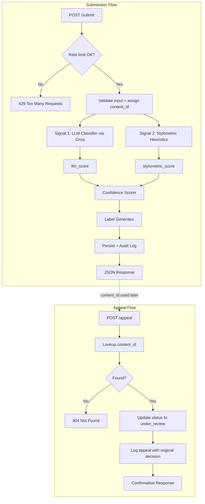

# Provenance Guard — Project Planning

> **Status:** Milestone 6 complete + all 4 stretch features implemented.

## Problem Statement

Creative sharing platforms need to help audiences understand whether posted work is likely human-authored or AI-generated — not to police creativity, but to protect attribution and build trust. Provenance Guard is a backend service that classifies submitted text, scores confidence in that classification, surfaces a plain-language transparency label, logs every decision for accountability, and lets creators appeal misclassifications.

---

## Architecture Narrative

When a creator submits a piece of text, here is the path it takes from input to the label a reader would see:

1. **Client request** — A platform sends a `POST /submit` request with the raw text and a `creator_id` identifying who posted it.

2. **Rate limiter** — Before any processing, Flask-Limiter checks whether this client has exceeded the allowed submission rate. If the limit is hit, the request is rejected with HTTP 429 and nothing else runs. This prevents abuse (script flooding) while allowing normal creator usage.

3. **Submission handler** — The Flask route validates the JSON body (required `text` and `creator_id` fields), assigns a unique `content_id` (UUID), and passes the text to the detection pipeline.

4. **Signal 1: LLM classifier (Groq)** — The text is sent to `llama-3.3-70b-versatile` with a structured prompt asking whether the writing reads as human-authored or AI-generated. The model returns a JSON score between 0 and 1, where higher values mean "more likely AI-generated." This signal captures semantic coherence, tone, and holistic stylistic patterns.

5. **Signal 2: Stylometric heuristics** — In parallel (or immediately after), pure Python computes statistical features of the text: sentence length variance, type-token ratio (vocabulary diversity), and punctuation density. These are combined into a single structural score between 0 and 1 (higher = more AI-like uniformity). No external API call — fast and free.

6. **Confidence scorer** — The two signal scores are combined (weighted average) into a single confidence score. The score represents how confident the system is in its attribution direction — not just "AI or human," but *how sure* we are. Scores near 0.5 mean genuine uncertainty.

7. **Label generator** — The confidence score maps to one of three transparency label variants (high-confidence AI, uncertain, high-confidence human). The exact label text is chosen to be understandable by a non-technical reader.

8. **Content store** — The submission record (content_id, creator_id, text, attribution, confidence, label, status) is persisted so appeals can reference it later.

9. **Audit logger** — A structured JSON entry is written capturing timestamp, content_id, creator_id, both individual signal scores, combined confidence, attribution result, label text, and status (`classified`).

10. **API response** — The handler returns JSON to the client: `content_id`, `attribution`, `confidence`, `label`, and individual signal scores for transparency.

**Appeal flow (separate path):**

1. A creator who disagrees with a classification sends `POST /appeal` with the `content_id` and `creator_reasoning` explaining why they believe the label is wrong.

2. The appeal handler looks up the original submission by `content_id`. If not found, return 404.

3. The content's status is updated from `classified` to `under_review`.

4. An audit log entry is appended (or the existing entry is updated) with the appeal reasoning, timestamp, and new status. The original classification decision is preserved alongside the appeal — a reviewer can see both.

5. The handler returns a confirmation that the appeal was received. No automated re-classification occurs; a human reviewer would act on the queue later.

6. **`GET /log`** — Exposes recent audit log entries as JSON for grading visibility and debugging.

---

## Detection Signals

We use three independent signals: semantic (LLM), structural (stylometrics), and lexical (phrase patterns).

### Signal 1: LLM Classifier (Groq — `llama-3.3-70b-versatile`)

| Aspect | Detail |
|---|---|
| **What it measures** | Semantic and stylistic coherence — whether the writing "reads" as human or AI-generated based on tone, phrasing patterns, and contextual naturalness. |
| **Output** | A float `llm_score` from 0.0 to 1.0 (0 = confident human, 1 = confident AI). Returned via structured JSON from the model. |
| **Why human vs. AI differs** | AI text often sounds polished but generic — smooth transitions, balanced clauses, hedging phrases ("it is important to note," "furthermore"). Human writing is messier: slang, uneven rhythm, personal asides, inconsistent formality. |
| **Blind spots** | Can be steered by framing or lightly edited AI output. Formal human academic writing may score AI-like. Short texts give the model little context. The model may reflect its own training biases rather than ground truth. |

### Signal 2: Stylometric Heuristics (Pure Python)

| Aspect | Detail |
|---|---|
| **What it measures** | Statistical structure: sentence length variance, type-token ratio (unique words ÷ total words), and punctuation density. |
| **Output** | A float `stylometric_score` from 0.0 to 1.0 (0 = human-like variability, 1 = AI-like uniformity). Computed as a weighted blend of normalized sub-metrics. |
| **Why human vs. AI differs** | AI text tends toward uniform sentence lengths, repetitive vocabulary, and low punctuation variation. Human writing — especially informal — is more lexically diverse and rhythmically irregular. |
| **Blind spots** | Cannot read meaning. A poem with intentional repetition and simple vocabulary may score AI-like. Technical writing with consistent structure may score AI-like despite being human. Highly variable AI output (if prompted for informality) can fool heuristics. |

### Signal 3: Phrase Pattern Fingerprint (Pure Python)

| Aspect | Detail |
|---|---|
| **What it measures** | Density of AI transition phrases and uniformity of sentence starters |
| **Output** | A float `phrase_score` from 0.0 to 1.0 (0 = human-like diction, 1 = AI boilerplate) |
| **Why human vs. AI differs** | AI text overuses template transitions ("Furthermore," "It is important to note") and starts sentences uniformly |
| **Blind spots** | Formal human writers who use academic transition words |

### Why this pairing

From the Week 4 lecture: signals should capture different properties (semantic, structural, lexical). Weaknesses in one are partially covered by others. When they disagree, the system lands in the "uncertain" band rather than force a strong label.

### Signal combination (implementation spec)

All three signals output a float from **0.0 (human-like) to 1.0 (AI-like)**. They are combined into a single `confidence` score:

```
confidence = (0.5 × llm_score) + (0.3 × stylometric_score) + (0.2 × phrase_score)
```

| Weight | Rationale |
|---|---|
| LLM 50% | Primary semantic judgment |
| Stylometrics 30% | Structural corroboration |
| Phrase patterns 20% | Lexical boilerplate detection |

**Signal disagreement rule:** If `max(scores) - min(scores) > 0.30`, or cross-conflict occurs (LLM ≤ 0.35 and structure/lexicon ≥ 0.50, or the reverse), cap attribution at `uncertain` unless `confidence ≤ 0.30`.

#### Stylometric sub-metrics (Signal 2 internals)

Text is split into sentences on `.`, `!`, `?`. Each sub-metric is normalized to 0–1 (1 = AI-like), then blended:

| Sub-metric | Computation | AI-like signal (→ 1.0) | Human-like signal (→ 0.0) |
|---|---|---|---|
| **Sentence length variance** | Variance of word-count per sentence | Variance < 5 | Variance > 30 |
| **Type-token ratio** | `len(set(words)) / len(words)` | TTR < 0.45 | TTR > 0.70 |
| **Punctuation density** | Punctuation chars ÷ total chars | Density < 0.02 | Density > 0.06 |

```
stylometric_score = (0.40 × variance_score) + (0.35 × ttr_score) + (0.25 × punct_score)
```

Each sub-metric is linearly interpolated between its human and AI thresholds, clamped to [0, 1].

#### LLM prompt contract (Signal 1 internals)

System prompt instructs the model to return JSON only:

```json
{
  "ai_likelihood": 0.0,
  "reasoning": "one sentence"
}
```

- `ai_likelihood`: float 0.0–1.0 (0 = confident human, 1 = confident AI)
- API call uses `response_format={"type": "json_object"}`
- **Parse failure fallback:** `llm_score = 0.5` (neutral — forces uncertain band rather than silently biasing AI or human)

---

## Uncertainty Representation

### What the confidence score means

The API field `confidence` is the **`ai_likelihood`** score: a single number from 0.0 to 1.0 representing how AI-generated the text appears.

| Score | Meaning to the system | Meaning to a reader |
|---|---|---|
| **0.0 – 0.39** | Strong evidence of human authorship | "This looks like a person wrote it" |
| **0.40 – 0.74** | Genuinely ambiguous — signals disagree or land in the middle | "We can't tell for sure" |
| **0.75 – 1.0** | Strong evidence of AI generation | "This looks machine-generated" |

**What 0.5 specifically means:** Maximum uncertainty. The system has no meaningful lean either way. A score of 0.51 and 0.95 must produce different labels — 0.51 lands in the uncertain band; 0.95 lands in high-confidence AI.

**What 0.6 means:** Leaning slightly AI-like but still in the uncertain band. The transparency label says we couldn't confidently determine authorship — not that it's "60% AI."

### Attribution mapping

Derived from `ai_likelihood` after applying the signal-disagreement rule:

| Condition | `attribution` value |
|---|---|
| `ai_likelihood >= 0.75` AND signals agree (or only human-agreement override) | `likely_ai` |
| `ai_likelihood <= 0.39` | `likely_human` |
| Everything else, OR signals disagree by > 0.30 | `uncertain` |

### Threshold design rationale

- **Asymmetric bands:** The uncertain zone is wider on the AI side (0.40–0.74) than a symmetric 0.35/0.65 split would be. Accusing a human of using AI is worse than missing AI content on a creative platform.
- **High AI bar at 0.75:** Requires strong agreement from both signals before showing a definitive AI label.
- **Human threshold at 0.39:** Lower bar — if either signal strongly suggests human writing, we give the benefit of the doubt.

### Validation plan (Milestone 4)

Test with four inputs from the project instructions plus our edge cases. Record both signal scores and final `ai_likelihood`. Expect:

| Input type | Expected `ai_likelihood` | Expected attribution |
|---|---|---|
| Clearly AI (corporate boilerplate) | ≥ 0.80 | `likely_ai` |
| Clearly human (casual ramen review) | ≤ 0.35 | `likely_human` |
| Formal academic human essay | 0.45 – 0.65 | `uncertain` |
| Lightly edited AI paragraph | 0.50 – 0.70 | `uncertain` |

If scores don't match intuition, inspect individual signal scores before adjusting thresholds.

---

## Transparency Label Design

Three label variants — exact text displayed to readers on the platform:

### High-confidence AI (`attribution: likely_ai`, `ai_likelihood >= 0.75`)

> **AI-Generated** — This piece shows strong signs of machine-generated writing. The phrasing, structure, and style closely match patterns typical of AI text. Creators can request a review if they believe this label is incorrect.

### Uncertain (`attribution: uncertain`, `0.40 <= ai_likelihood < 0.75`)

> **Authorship Unclear** — We couldn't confidently determine whether this was written by a person or generated by AI. The writing style falls in an ambiguous range. If you're the creator and this doesn't seem right, you can request a human review.

### High-confidence human (`attribution: likely_human`, `ai_likelihood <= 0.39`)

> **Human-Written** — This piece appears to be written by a person. The voice, rhythm, and word choices reflect natural human expression rather than machine-generated patterns.

### Label function signature (for implementation)

```python
def generate_label(attribution: str) -> str:
    """Map attribution category to transparency label text."""
```

The `label` field in API responses is the full text above (without the category header). The `confidence` field carries the numeric score separately.

---

## Appeals Workflow

### Who can appeal

Any creator who submitted content through `POST /submit`. The appeal request must include the `content_id` returned from that submission. For MVP, we do not require `creator_id` on the appeal endpoint — possession of the `content_id` is sufficient (in production, we'd verify identity).

### What the creator provides

| Field | Required | Description |
|---|---|---|
| `content_id` | Yes | UUID from the original `/submit` response |
| `creator_reasoning` | Yes | Free-text explanation of why the label is wrong (min 10 chars) |

### What the system does on appeal

1. Look up submission by `content_id` → 404 if not found
2. Reject if status is already `under_review` (duplicate appeal) → 409
3. Update content record: `status` → `under_review`
4. Append fields to audit log entry: `appeal_reasoning`, `appeal_timestamp`, preserve original `attribution`, `confidence`, `llm_score`, `stylometric_score`, and `label`
5. Return confirmation JSON with `status: under_review`

No automated re-classification. A human reviewer would act on the queue externally.

### What a human reviewer sees

When opening the appeal queue (via `GET /log` filtered to `status: under_review`), each entry shows:

| Field | Purpose |
|---|---|
| `content_id` | Reference ID |
| `creator_id` | Who submitted |
| `text` (truncated to 500 chars) | The actual content |
| `attribution` + `confidence` | Original machine decision |
| `llm_score` + `stylometric_score` | Individual signal breakdown |
| `label` | What the reader currently sees |
| `appeal_reasoning` | Creator's explanation |
| `timestamp` vs `appeal_timestamp` | When classified vs when appealed |

Reviewer actions (out of scope for MVP): uphold label, change to human-written, or remove label entirely.

---

## Anticipated Edge Cases

### Edge case 1: Repetitive poetry with simple vocabulary

A poem using intentional repetition, short lines, and limited vocabulary (e.g., a haiku sequence or spoken-word piece with refrains).

- **Stylometrics:** Low sentence-length variance and low TTR → `stylometric_score` ≈ 0.70–0.85
- **LLM:** May or may not recognize poetic intent → `llm_score` ≈ 0.50–0.70
- **Likely outcome:** Signal disagreement rule triggers → `uncertain` even if `ai_likelihood` ≈ 0.65
- **Mitigation:** Creator appeals; reviewer reads the actual poem

### Edge case 2: Formal academic human writing

A scholarly paragraph with consistent sentence structure, field-specific vocabulary, and hedging language (e.g., economics or legal writing).

- **Stylometrics:** Uniform sentence lengths, moderate TTR → `stylometric_score` ≈ 0.55–0.70
- **LLM:** Polished prose may read as AI → `llm_score` ≈ 0.60–0.75
- **Likely outcome:** `uncertain` band — both signals lean AI-ish but neither is extreme
- **Mitigation:** Wide uncertain band protects the author; appeal path available

### Edge case 3: Very short submissions (< 30 words)

A tweet-length post or single-sentence submission.

- **Stylometrics:** Unreliable — not enough sentences for variance; TTR unstable
- **LLM:** Limited context for judgment
- **Likely outcome:** Both signals regress toward 0.5 → `uncertain`
- **Mitigation:** If word count < 30, skip stylometric sub-metrics and set `stylometric_score = 0.5`; rely on LLM only with reduced weight

### Edge case 4: Lightly edited AI output

AI-generated draft with casual edits — slang inserted, sentences reordered, one paragraph rewritten by hand.

- **Stylometrics:** May show more variance after edits → `stylometric_score` ≈ 0.45–0.60
- **LLM:** Often still detects underlying AI patterns → `llm_score` ≈ 0.55–0.70
- **Likely outcome:** `uncertain` — system acknowledges partial human touch without certifying human authorship

---

## False Positive Scenario

**Scenario:** A poet submits a piece with heavy repetition, simple vocabulary, and uniform line lengths — deliberate artistic choices.

| Step | What happens |
|---|---|
| Stylometrics | Low sentence-length variance and low type-token ratio → `stylometric_score` ≈ 0.75 (looks AI-like) |
| LLM classifier | May recognize poetic intent, but could also flag the uniformity → `llm_score` ≈ 0.55–0.70 |
| Combined confidence | Weighted average lands in the **uncertain** band (≈ 0.55–0.65), not high-confidence AI |
| Label shown | *"Authorship Unclear — We couldn't confidently determine whether this was written by a person or generated by AI..."* |
| Creator action | Submits `POST /appeal` with reasoning: *"This is original poetry; the repetition is intentional."* |
| System response | Status → `under_review`; appeal logged alongside original scores; human reviewer decides |

**Design principle:** On a writing platform, falsely labeling human work as AI is worse than missing AI content. Our scoring and label thresholds bias toward uncertainty when signals conflict, and the appeals path gives creators recourse.

---

## API Surface

### `POST /submit`

Submit text for attribution analysis.

**Request body:**
```json
{
  "text": "The poem or story excerpt to analyze...",
  "creator_id": "user-abc-123"
}
```

**Success response (200):**
```json
{
  "content_id": "3f7a2b1e-8c4d-4e5f-9a0b-1c2d3e4f5a6b",
  "attribution": "likely_ai",
  "confidence": 0.82,
  "label": "AI-Generated — This piece shows strong signs of machine-generated writing. The phrasing, structure, and style closely match patterns typical of AI text. Creators can request a review if they believe this label is incorrect.",
  "llm_score": 0.85,
  "stylometric_score": 0.78,
  "status": "classified"
}
```

**Rate limit exceeded (429):**
```json
{
  "error": "Rate limit exceeded. Please slow down and try again shortly."
}
```

**Validation error (400):** Missing `text` or `creator_id`.

---

### `POST /appeal`

Contest a classification.

**Request body:**
```json
{
  "content_id": "3f7a2b1e-8c4d-4e5f-9a0b-1c2d3e4f5a6b",
  "creator_reasoning": "I wrote this myself. The formal tone is intentional — it's an academic essay."
}
```

**Success response (200):**
```json
{
  "content_id": "3f7a2b1e-8c4d-4e5f-9a0b-1c2d3e4f5a6b",
  "status": "under_review",
  "message": "Your appeal has been received and is under review."
}
```

**Not found (404):** Unknown `content_id`.

---

### `GET /log`

Return recent audit log entries for grading and debugging.

**Success response (200):**
```json
{
  "entries": [
    {
      "content_id": "3f7a2b1e-...",
      "creator_id": "user-abc-123",
      "timestamp": "2026-06-30T14:32:10.123Z",
      "attribution": "likely_ai",
      "confidence": 0.82,
      "llm_score": 0.85,
      "stylometric_score": 0.78,
      "label": "AI-Generated — This piece shows strong signs of machine-generated writing...",
      "status": "under_review",
      "appeal_reasoning": "I wrote this myself..."
    }
  ]
}
```

---

## Architecture

**Submission flow (narrative):** A client posts text to `POST /submit`, which passes through rate limiting and validation before running two independent detection signals — an LLM classifier and stylometric heuristics. Their scores are combined into an `ai_likelihood` confidence score, mapped to an attribution category and plain-language transparency label, then persisted and logged before the JSON response is returned.

**Appeal flow (narrative):** A creator who disagrees with a label posts to `POST /appeal` with the `content_id` and their reasoning. The system looks up the original submission, updates its status to `under_review`, and appends the appeal to the audit log while preserving the original classification — no automated re-scoring occurs.

### Submission flow

```
Client                    Flask App                 Detection Pipeline              Storage
  |                           |                              |                          |
  |-- POST /submit ---------->|                              |                          |
  |   {text, creator_id}      |                              |                          |
  |                           |-- rate limit check --------->|                          |
  |                           |   (reject 429 if exceeded)   |                          |
  |                           |                              |                          |
  |                           |-- validate + assign UUID --->|                          |
  |                           |                              |                          |
  |                           |-- Signal 1: LLM classifier ->| Groq API                 |
  |                           |<-- llm_score (0-1) ----------|                          |
  |                           |                              |                          |
  |                           |-- Signal 2: Stylometrics --->| pure Python              |
  |                           |<-- stylometric_score (0-1) --|                          |
  |                           |                              |                          |
  |                           |-- confidence scorer -------->| weighted average         |
  |                           |<-- confidence + attribution -|                          |
  |                           |                              |                          |
  |                           |-- label generator ---------->| map score → label text   |
  |                           |<-- transparency label -------|                          |
  |                           |                              |                          |
  |                           |-- persist + audit log -------------------------------->| SQLite/JSON
  |                           |                              |                          |
  |<-- JSON response ---------|                              |                          |
  |   {content_id,            |                              |                          |
  |    attribution,           |                              |                          |
  |    confidence, label,     |                              |                          |
  |    llm_score,             |                              |                          |
  |    stylometric_score}     |                              |                          |
```

### Appeal flow

```
Creator                   Flask App                 Storage                    Audit Log
  |                           |                         |                          |
  |-- POST /appeal ---------->|                         |                          |
  |   {content_id,            |                         |                          |
  |    creator_reasoning}     |                         |                          |
  |                           |-- lookup content_id --->|                          |
  |                           |<-- original record -----|                          |
  |                           |                         |                          |
  |                           |-- update status ------->| status: under_review     |
  |                           |                         |                          |
  |                           |-- append appeal entry -------------------------------->|
  |                           |   (preserve original    |                          |
  |                           |    classification)      |                          |
  |                           |                         |                          |
  |<-- confirmation ----------|                         |                          |
  |   {status: under_review}  |                         |                          |
```

### Mermaid diagram



### Component summary

| Component | Role |
|---|---|
| **Flask app** | HTTP layer; routes, validation, response formatting |
| **Rate limiter** | Flask-Limiter on `/submit`; blocks abuse before pipeline runs |
| **LLM classifier** | Groq API call; semantic AI-vs-human assessment → `llm_score` |
| **Stylometric analyzer** | Pure Python; structural metrics → `stylometric_score` |
| **Confidence scorer** | Combines both signals into one calibrated score |
| **Label generator** | Maps confidence bands to plain-language transparency text |
| **Content store** | SQLite (or in-memory dict for MVP); submissions + status |
| **Audit logger** | Structured JSON log of every decision and appeal |

### Rate limiting (planned for Milestone 5)

| Limit | Value | Rationale |
|---|---|---|
| Per minute | 10 requests / IP | A real creator submits a few pieces per session; 10/min allows rapid testing but blocks scripts |
| Per day | 100 requests / IP | Prevents sustained flooding while allowing heavy legitimate use |

Applied only to `POST /submit` via Flask-Limiter with `storage_uri="memory://"`.

### Storage (planned)

| Store | Technology | Contents |
|---|---|---|
| Content store | SQLite (`provenance.db`) | Submissions: content_id, creator_id, text, attribution, confidence, label, status |
| Audit log | Append-only JSON file (`audit_log.json`) | Every classification decision and appeal, structured entries |

---

## AI Tool Plan

Use `planning.md` sections + architecture diagram as context when prompting AI tools during Milestones 3–5. Review and edit all generated code before committing.

### M3: Submission endpoint + first signal

| Item | Detail |
|---|---|
| **Spec sections to provide** | Detection Signals (LLM contract + stylometric overview), API Surface (`POST /submit`), Architecture diagram |
| **Ask AI to generate** | Flask app skeleton (`app.py`), `POST /submit` route stub, `classify_with_llm(text)` function, basic audit log helper, `GET /log` endpoint |
| **Verify before merging** | Route accepts `text` + `creator_id` and returns `content_id`; LLM function returns float 0–1 matching spec; audit log writes structured JSON with timestamp + signal score; `GET /log` returns entries; test LLM function standalone with 2–3 inputs before wiring |

### M4: Second signal + confidence scoring

| Item | Detail |
|---|---|
| **Spec sections to provide** | Detection Signals (stylometric sub-metrics + combination formula), Uncertainty Representation (thresholds + disagreement rule), Architecture diagram |
| **Ask AI to generate** | `compute_stylometric_score(text)` function, `combine_scores(llm_score, stylometric_score)` function, `determine_attribution(ai_likelihood, llm_score, stylometric_score)` function |
| **Verify before merging** | Scoring function uses exact weights (0.6/0.4) and thresholds (0.75/0.39) from spec; disagreement rule caps at uncertain when delta > 0.30; test all 4 benchmark inputs — clearly AI scores ≥ 0.75, clearly human scores ≤ 0.39; audit log records both individual signal scores |

### M5: Production layer

| Item | Detail |
|---|---|
| **Spec sections to provide** | Transparency Label Design (all 3 variants), Appeals Workflow, Rate limiting table, Architecture diagram |
| **Ask AI to generate** | `generate_label(attribution)` function, `POST /appeal` endpoint, Flask-Limiter setup on `/submit` |
| **Verify before merging** | All 3 label texts match spec verbatim; submitting borderline text returns uncertain label; appeal updates status to `under_review` and appears in audit log with `appeal_reasoning`; rate limit test shows 200 for first 10 requests then 429; short-text edge case (< 30 words) handled |

---

## Milestone 2 Checkpoint

- [x] Detection signals described with output format and combination formula
- [x] Uncertainty representation with specific thresholds (0.75 / 0.40 / 0.39) and disagreement rule
- [x] Three transparency label variants written out verbatim
- [x] Appeals workflow: who, what, status changes, reviewer view, duplicate handling
- [x] Four anticipated edge cases with specific scenarios and expected behavior
- [x] `## Architecture` section with diagram + submission/appeal narratives
- [x] `## AI Tool Plan` covering M3, M4, M5 with spec sections, generation targets, and verification steps

**Next:** Milestone 6 — README documentation and portfolio walkthrough.

---

## Milestone 5 Checkpoint

- [x] `POST /appeal` — accepts `content_id` + `creator_reasoning`, returns confirmation
- [x] Status updates to `under_review` in SQLite store
- [x] Audit log updated with `appeal_reasoning`, `appeal_timestamp`, original classification preserved
- [x] Duplicate appeal returns 409
- [x] Flask-Limiter on `POST /submit`: `10 per minute; 100 per day` per IP
- [x] Rate limit test: HTTP 429 after limit exceeded
- [x] Audit log includes `text` (truncated), both signal scores, timestamp, and appeal fields

**Rate limit evidence (12 rapid requests after prior submissions in window):**
```
200 × 9, then 429 × 3
```
(One earlier `/submit` in the same minute consumed the 10th allowed slot.)

**Implementation files updated:** `app.py`, `store.py`, `audit_log.py`

---

---

## Stretch Features

Updated before implementation of each stretch feature per project instructions.

### Stretch 1: Ensemble Detection

**Signal 3 — Phrase Pattern Fingerprint** (`signals/phrase_patterns.py`):

| Aspect | Detail |
|---|---|
| **Measures** | Density of AI transition phrases and uniformity of sentence starters |
| **Output** | `phrase_score` float 0.0–1.0 |
| **Blind spots** | Formal human writers using academic transitions |

**Ensemble weights:**

```
confidence = (0.5 × llm_score) + (0.3 × stylometric_score) + (0.2 × phrase_score)
```

**Conflict resolution:** If `max(scores) - min(scores) > 0.30` or cross-conflict (LLM human + structure/lexicon AI), cap at `uncertain` unless `confidence ≤ 0.30`.

### Stretch 2: Provenance Certificate

Creators complete verification via `POST /verify`:

1. Submit `attestation` (≥ 50 chars) — legal-style statement of human authorship
2. Submit `writing_sample` (≥ 30 words) — original prose sample
3. Record stored in `creators` SQLite table with `verified_at` timestamp

When a verified creator's submission is classified `likely_human`, the response appends a **certificate badge** distinguishable from the standard transparency label:

> [Verified Human Creator] — This creator completed a writing attestation and passed multi-signal review. This badge is separate from the standard transparency label above.

Returned as separate `certificate_label` field alongside `label`.

### Stretch 3: Analytics Dashboard

`GET /analytics` returns JSON metrics; `GET /dashboard` renders HTML view.

| Metric | Source |
|---|---|
| AI vs human vs uncertain ratio | Count `attribution` values in audit log |
| Appeal rate | Entries with `appeal_reasoning` ÷ total |
| Average confidence | Mean `confidence` across entries |
| Under review count | Entries with `status: under_review` |

### Stretch 4: Multi-Modal Support

`POST /submit` accepts `content_type`:

| Type | Field | Handling |
|---|---|---|
| `text` | `text` | Direct analysis |
| `image_description` | `image_description` | Same 3-signal pipeline on description text |
| `metadata` | `metadata` object | Concatenate title + caption + tags → analyze |

`pipeline.py` normalizes all types to analyzable text before running the ensemble.

### Stretch UI

`GET /ui` — browser submission form for all content types.
`GET /dashboard` — analytics dashboard.

---

## Milestone 6 Checkpoint

- [x] README covers architecture overview, detection signals, confidence scoring, transparency labels
- [x] Two example submissions with different confidence scores (0.70 vs 0.31)
- [x] All three label variants written out verbatim
- [x] Rate limiting documented with 429 evidence
- [x] Audit log sample with 3+ entries including one appeal
- [x] Known limitations, spec reflection, and AI usage (3 instances)
- [x] Portfolio walkthrough script included in README
- [x] Stretch: ensemble detection (3 signals + weights)
- [x] Stretch: provenance certificate (`POST /verify`)
- [x] Stretch: analytics dashboard (`GET /dashboard`)
- [x] Stretch: multi-modal support (`text`, `image_description`, `metadata`)
- [ ] Portfolio walkthrough **video** — record and submit to course portal (student action)

---

## Milestone 4 Checkpoint

- [x] `compute_stylometric_score(text)` — variance (std dev), TTR, punctuation density
- [x] `combine_scores()` — 0.6 LLM + 0.4 stylometric weighted blend
- [x] `determine_attribution()` — thresholds (0.75 / 0.39) + signal disagreement rules
- [x] `generate_label()` — all three transparency label variants
- [x] Audit log records `llm_score` and `stylometric_score` per submission
- [x] Benchmark validation (4 test inputs):

| Input | llm | styl | confidence | attribution |
|---|---|---|---|---|
| Clearly AI (corporate boilerplate) | 0.80 | 0.55 | 0.70 | uncertain |
| Clearly human (casual review) | 0.20 | 0.47 | 0.31 | likely_human |
| Formal academic essay | 0.80 | 0.55 | 0.70 | uncertain |
| Lightly edited AI | 0.20 | 0.56 | 0.35 | uncertain |

Clearly AI lands in uncertain at 0.70 — conservative by design when signals partially disagree. Human and borderline cases behave as expected.

**Implementation files added:** `signals/stylometrics.py`, `scoring.py`

- [x] Flask app runs with `POST /submit` and `GET /log`
- [x] `classify_with_llm(text)` returns float 0–1 via Groq structured JSON
- [x] Submissions return `content_id`, `attribution`, `confidence` (placeholder), `label` (placeholder), `llm_score`
- [x] Each submission writes a structured audit log entry with timestamp
- [x] Content persisted in SQLite for appeals in M5
- [x] Input validation for missing `text` or `creator_id`

**Implementation files:** `app.py`, `signals/llm_classifier.py`, `audit_log.py`, `store.py`
